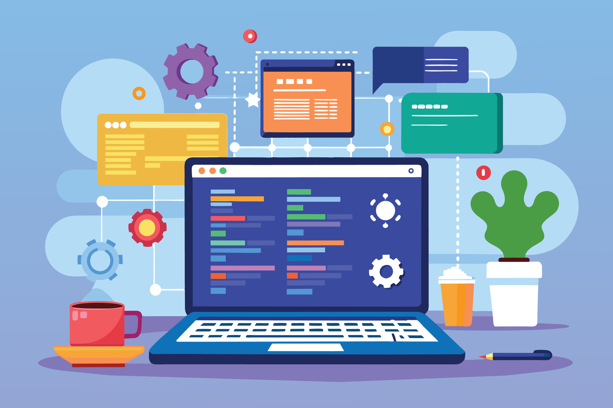

Whenever I begin a new topic or class on the ICS pathway, I dread the change from the previous teaching style. It always seems to come right after I get accustomed to my routine. This semester was no different when I was introduced to the concept of a flipped classroom. I immediately hated the idea because my favorite part of college so far has been the lectures. For the past two years, I often wondered whether or not I was meant to pursue a degree in computer science. Attending lectures would reignite my fire to grow my knowledge and understanding. I always left ICS classes feeling inspired and excited to tackle the next assignment or challenge. Flipped classrooms, however, do not offer the same reassurance. While the modules give some structure, they do not bring the same excitement and inspiration that a good lecture would.    

## Another class means another language.
Throughout college, I’ve encountered Java, Python, C, C++, and recently, Javascript and Typescript. After learning Java, I thought I would hate every new language I encountered, but I looked forward to learning Python. In ICS 141, I used Python for a handful of homework submissions, but I never truly felt like I learned it. I hated its simplicity and the stark contrast in syntax compared to Java, which I had already started to get more comfortable with. Then when it came to learning C and C++, I immediately fell in love with the meticulousness of pointers and references. Since I loved using Java, C, and C++, I assumed Python would be the only language I disliked. I was wrong.

Compared to the languages I’ve learned so far, Javascript and Typescript do not feel much different outside of the syntax. I like the simplicity of the data types since there are only three. However, there are some concepts like arrow functions and destructuring that I’m not particularly fond of. I feel like they make things more awkward and unclear than they could be. It might just be a matter of time until I adjust to Typescript's style but for first impressions, the language feels like a mix of the discomfort that I felt with Python and the complexity I did not experience with C. Whether this discomfort is due to my lack of familiarity or the nature of Typescript, only time will tell.

Whether it’s adjusting to new programming languages like Python, C++, JavaScript, and TypeScript, or adapting to the flipped classroom model, I have to reassure myself that the discomfort is an essential part of my journey. Just like in every other class, these new languages and new concepts are just another reminder that I will only grow if I step outside of my comfort zone. After all, if I had quit after one difficult class, I would never have discovered my passion for coding.
