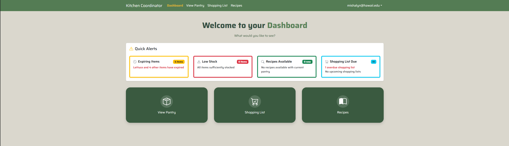
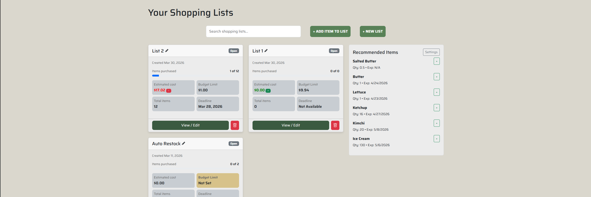
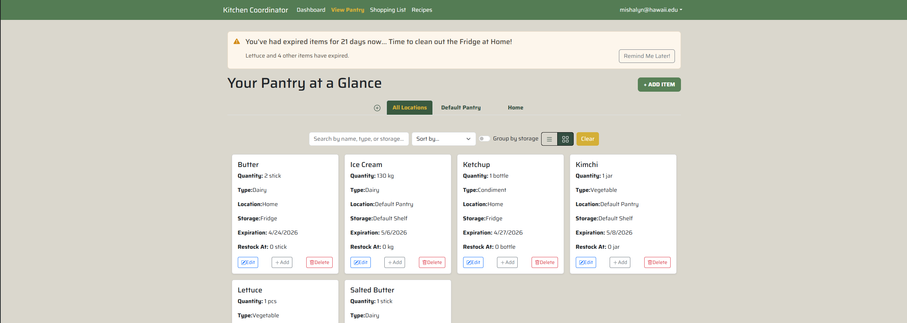
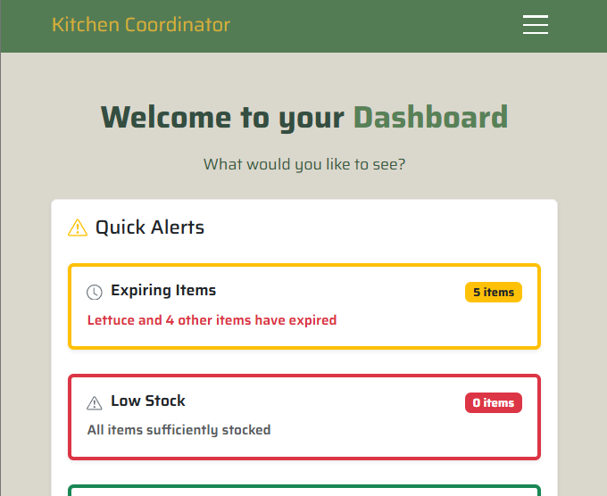

## Overview

For ICS 414, I worked with a team of four other members to add to an existing web application designed to manage food items across multiple locations and storages. We forked our project from [Pantry Pals](https://pantry-pals.vercel.app/) and udpated their web-app to improve mobile responsiveness, improve item conversions and custom units, link existing systems, fix existing bugs, and overall add more functionality. As of currently, the site has multiple pages including a user dashboard, pantry overview, shopping list overview, and a recipes catalogue. The end goal stayed the same, just with additional improvements. 

## Contributions

Outside of coding, I handled project planning and coordination for our team. This included initiating team meetings, presenting project updates during milestones, maintaining and updating the project board, setting up the review tasks, and creating user stories to help brainstorm our tasks. 

### Technical Contributions
My technical contributions mostly delved in UI changes, refactoring, fixing bugs, and some general improvements. 

To account for our project goal of making the web-application more mobile friendly, I made UI adjustments across various components and pages. Overall, I wanted to ensure a smoother and accessible experience for users. Out of all of them, I think my favorite to make was the animated hamburger dropdown on the navbar.

Another notable component I worked on dealt with expired food items. During one of the later milestones, I noticed a bug in the Quick Alerts section on the Dashboard page where it mishandled cases where the expiry date on an item had passed and where the shopping-date for a list had passed. I refactored code for this component to better handle these cases and to better reflect the urgency between expired and soon to expire items. Also, the inherited code had outdated logic that didn't interact properly with shopping lists' outing dates and used a static offset instead, so I modified the component to properly reflect planned shopping dates. 

While working on updating the Quick Alerts component, I realized that it would be beneficial to notify users that they have expired items on the Pantry page so that they wouldn't need to search for that item. Then I created a notification for the Pantry page that appears only when the user has an expired item in a pantry location. In case users may not want that reminder, I also made the banner temporarily removable only to reappear when users revisit or refresh the page. The user may have many expired items at varying points of expiry, so the text dynamically reflects the severity. 

Another major part of my contribution was refactoring the codebase to make it cleaner, more reusable, and easier to maintain. During code reviews, I noticed redundancy in several functions as well as repeated inline styling. Although the inherited codebase already implemented multiple CSS modules and classes for custom styling, there were still many components that repeated inline styling and made code difficult to read and update easily. To address this, I organized repeated code into reusable classes to improve consistancy and readibility. 

Throughout development, we also encountered various technical challenges including configuration setup issues, schema migrations, and merge conflicts. While some of this work may not be fully reflected in my GitHub contributions, I found these experiences especially valuable because they helped me with my debugging, problem-solving, and collaboration skills. 

## Reflection

One thing I regret is not finishing the expired items component. Since that feature felt more concrete and user facing, I would have liked to fully complete it with extra actions and more interesting notifications, but I am still glad that I contributed in other ways.

I gained a lot of experience in ICS 414. I developed both my collaboration skills, such as planning and properly communicating, and technical skills such as, refactoring and debugging. I am especially glad to have started from an inherited codebase rather than the clean code template we used in ICS 314. It felt more realistic and helped me learn how to understand unfamiliar code and identify areas for improvement which will likely help me a lot in the future.

I also gained a lot more familiarity with Prisma and GitHub's commands. For this project, I challenged myself to use their desktop app less and use the command line more often. With that I feel more comfortable with common Git commands and more confident when switching branches and pulling changes than I did at the start of the semester. Overall, I feel more confident in my ability to contribute to a team, learn from unfamiliar code, and to improve as a developer. 

## Project Links

(Kitchen Coordinator Repository)[https://github.com/kitchen-coordinator]
(Project Progress Page)[https://kitchen-coordinator.github.io/]
