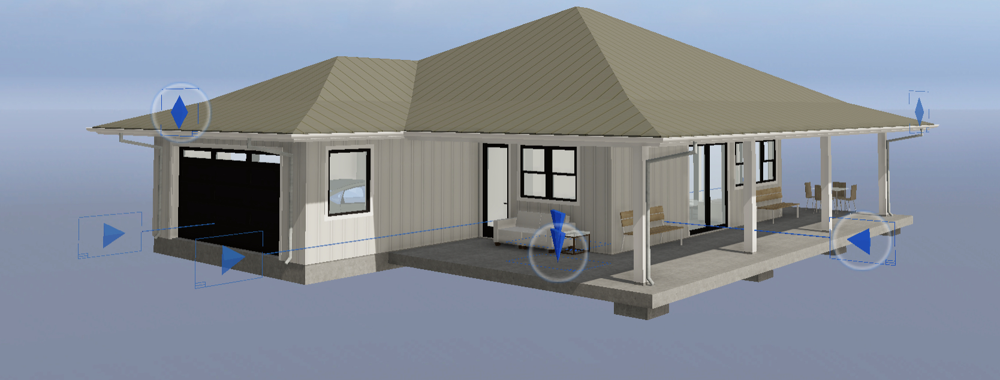
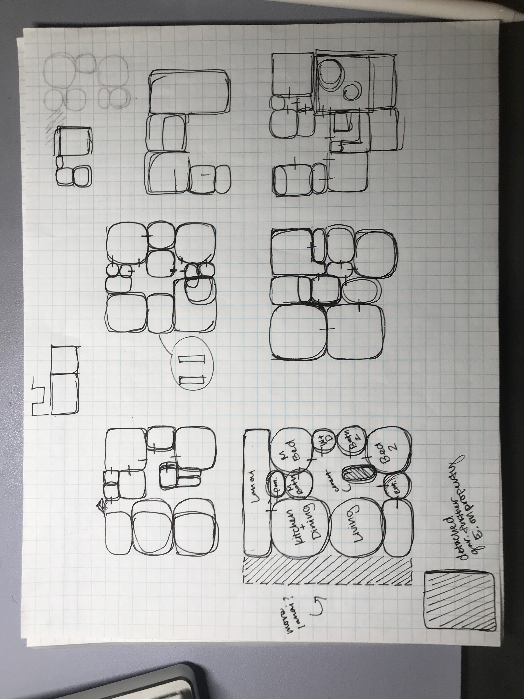
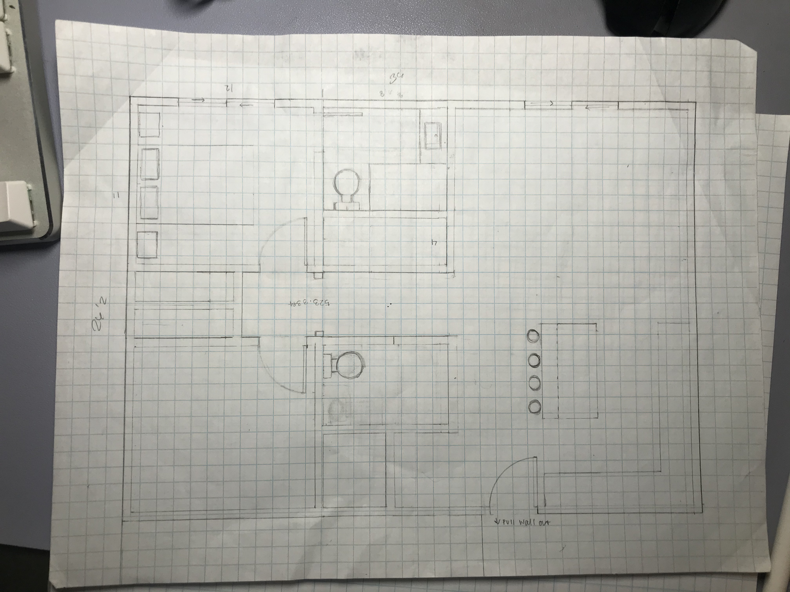

This 2-bedroom building is a 3D model and plan that I created during my internship at Kaspryzcki Designs in Spring 2023 for my final year of high school. It was created with a plantation-style farmhouse in mind. On the construction site visits, I often encountered homes on agricultural land which heavily influenced the design choices I made. I created the floor plan, roof plan, furniture plan, door/window schedule, elevation views, as well as the 3D model for the building.

I was responsible for the design, drafting, and modeling of the building with the guidance of the architects I worked with. When I waas drafting, they would watch over me or check in on me while they were occupied with meetings or projects. I started with very rough drafts on paper which looked like nothing more than just circles and squares mapping out the room placements. This allowed me to get a sense of the layout which I used as a reference when drafting the floor plan. While drafting, I had to keep in mind the flow of the furniture in the building as well as the lighting and ventilation. For example, I chose to give the hallway closet a sliding door to avoid the swing that a normal door would occupy in the hallway. Upon completion, I presented my design and process to a board of instructors and community members. 

On top of the archiCAD and design skills I learned, this experience taught me how to present my ideas, proper planning, as well as communcation. The presentation portion taught me to clearly and effectively explain my ideas to an audience. Needing to documeent my steps taught me to make a thoughtful schedule for my project. Working with the architects taught me the various inner workings of an architecture firm and more generally, they taught me how to communicate and work with a team. 

Below are some very rough drafts for the design.

  
  

