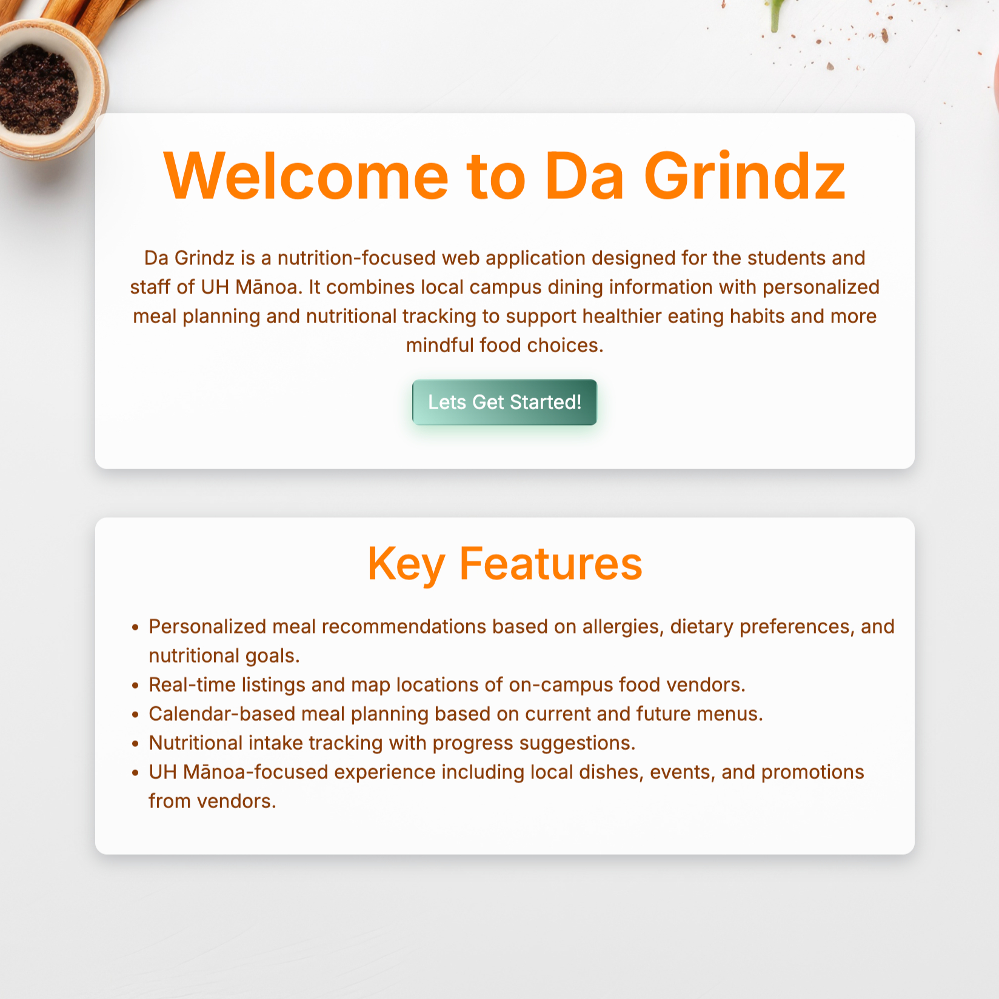
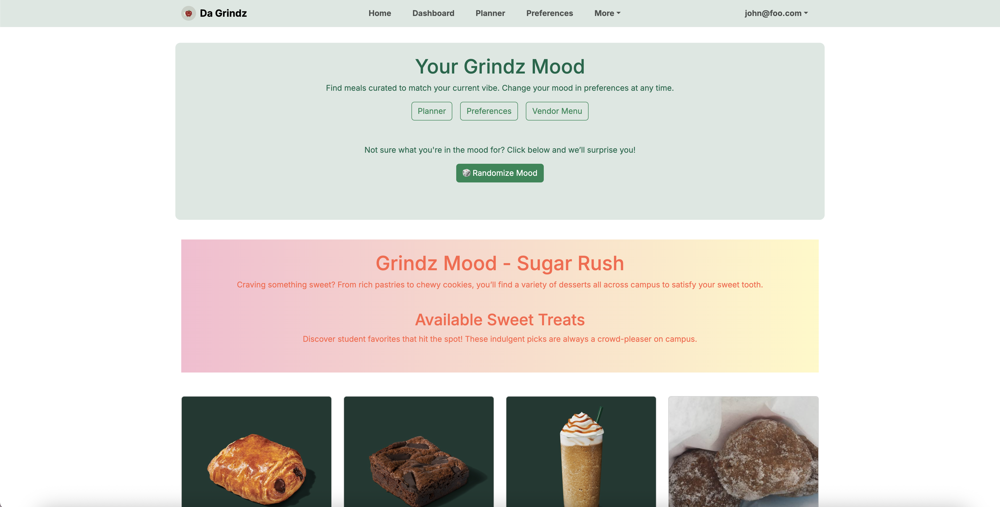

## Overview

It can be difficult to choose what to eat and even harder to plan it out for a week. For our final project in ICS 314, my team and I created Da-Grindz, a web-application for students and staff of UH Manoa. To assist with meal planning, the app offers a meal planner that allows users to pick meals and place them in a schedule. The planner also offers insights into the macros of the meal for people concerned about their meal goals. In addition, users are able to set their preferences such as their allergies and their preferred "Grindz Mood." The Grindz Mood will affect the user's dashboard and planner, changing their appearances according to the mood picked. To help users decide where to eat, the site offers an interactive map for users to find locations as well as a page rendering the locations and their details. 

    
    

## Contributions

For this project, my main contributions lied in creating forms to edit the database and collecting sample data.  Below are some of the pages I've created.

    
    
    

I created a total of 3 types of forms, allowing different types of users to interact with the site,
* User: Add/Edit allergens and Grindz Mood
* [Vendor: Add/Edit/Delete Menu Items]
* [Admin: Edit user Role and Vendor Location]

In addition to two descriptive pages,
* Grindz Mood 
* Allergies

For the site to populate with usable data, I gathered around 60+ menu items for the database. 

### Links
For more information about the project, [Da Grindz Project Page](https://da-grindz.github.io/)
To see our website deployed on Vercel, [Da Grindz Website](https://da-grindz.vercel.app/)
To see the code directly, [Da Grindz Organization Page](https://github.com/da-grindz)

## Takeaways

This project allowed me to practice skills that I gained throughout ICS 314 like creating forms that allow users to interact with the database and custom styles for components. Although, I found the most valuable skills gained from this project to be researching and troubleshooting. Despite having a template, I often found it difficult to translate the premade components to work with our schemas and find the right type of keywords or elements to use. A lot of my time for this project was spent trying to figure out why a component would not render or why the database refused to update, however this only strengthened my patience and improved my understanding.

I also learned that working with a team can be extremely difficult. I found it especially hard for us all to get on the same page with our conflicting schedules. A major issue was a lack of communication which lead to a few setbacks, some minor and some major. In the end, I'm thankful for the experience and for all of the skills it left me with.
