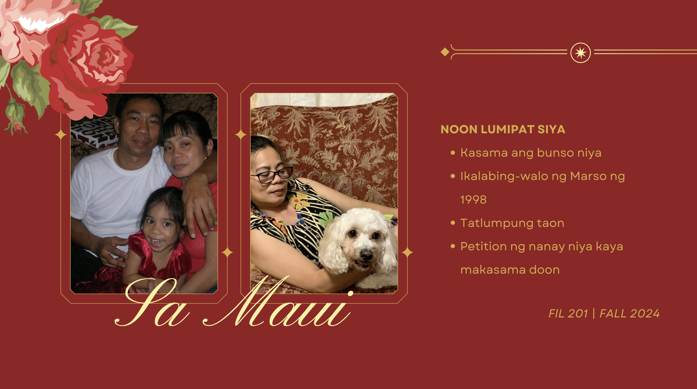

  

This project was about telling a story about someone with an intermediate level of Filipino. I needed to interview someone who originally lived in the Philippines and learn about their story. Why did they move? Where did they move to? What were their hardships and how did they overcome them? Once I had all these answers, I had to narrate all of these points to my peers. The only challenge was that this was not a cultural or social studies class. It was a language class, which meant that I needed to do all of this in Tagalog.

For this project, I was responsible for conducting an interview, writing a narrative essay, and creating a presentation in Tagalog. For my interviewee, I decided on interviewing my mother since she speaks slower than my father and grandparents do. Since she does not live in Oahu, I was unable to interview her in person and instead spoke to her over a zoom call. She struggles to use technology so I had to walk her through using zoom for the first time. For the interview, I recorded myself to refer back to while creating the essay and presentation and spoke to her strictly in Tagalog. During this recording, I practiced using enclitics as well as new affixes to reinforced the ideas taught in class. When creating the presentation, I included intermediate level affixes such as pa, maka, and maki in addition to expressing emotions. 

Aside from improving my understanding of Tagalog, this project improved my ability to speak in front of others. Not only that but this experience allowed me to learn more about the cultural and economic differences of growing up in Hawaii compared to the Philippines. I never fully understood the hardships of growing up in a country such as the Philippines but my mother's story as well as my peers' narratives showed how diffifcult it can be to grow up with nothing. Listening to all the different ways they grew up left me with a newfound appreciation for all of the opportunities that I have here in Hawaii.

I created the presentation using [Canva](https://www.canva.com/design/DAGXK3Fz67o/m0Pav1Bieb_pyT7F7BgvOw/edit?utm_content=DAGXK3Fz67o&utm_campaign=designshare&utm_medium=link2&utm_source=sharebutton).
